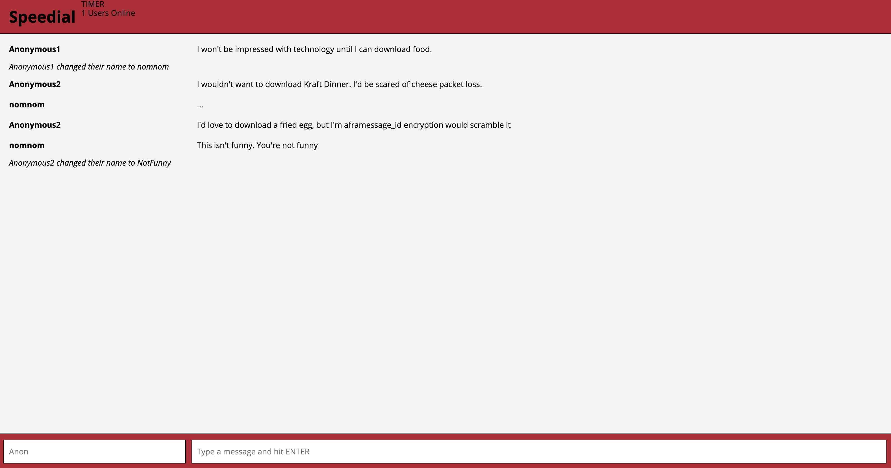

Speedial Chat Application
=====================

A chat application for users to talk to one another, where new users have access up to the last 20 lines of the chat

### Usage

install the package 
```
npm install
npm start
open http://localhost:3000
```

Set up Server 
go to server file in directory and run "node server.js"


### Screenshots



### Dependencies

* React
* Webpack
* [babel-loader](https://github.com/babel/babel-loader)
* [webpack-dev-server](https://github.com/webpack/webpack-dev-server)
* "sockjs-client": "^1.1.2",
